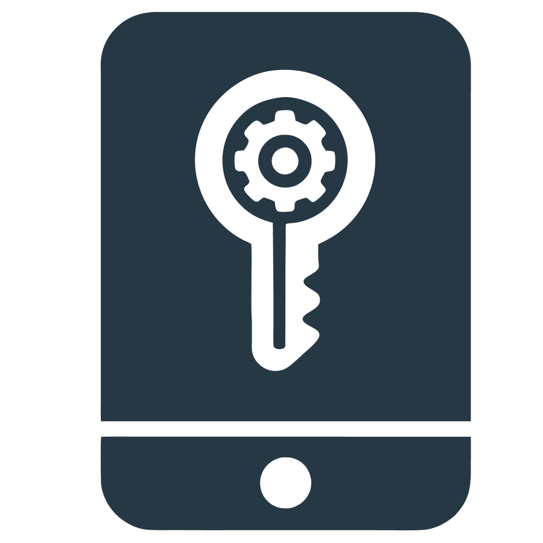
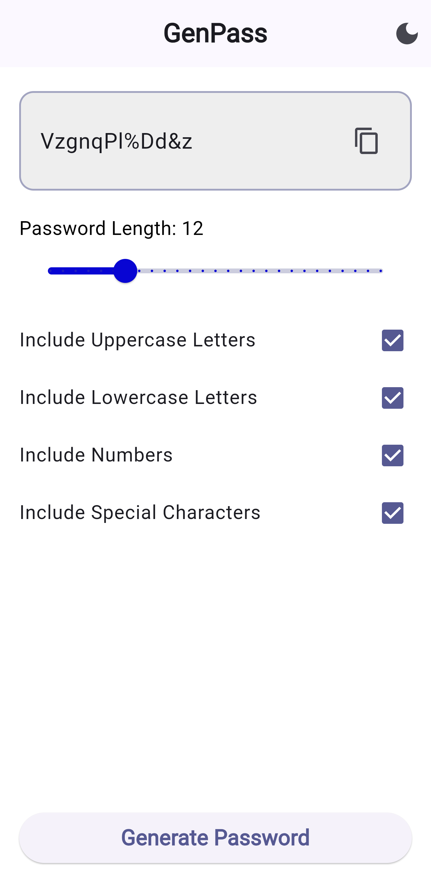

<h1 align="center">GenPass</h1> 

GenPass is a Flutter-based project designed to generate secure passwords effortlessly.

<h2>🔧 Features</h2> 

- Generate random, strong passwords.
- Customize password length and complexity.
- Easy-to-use Flutter interface.

## 📱 Screenshot 



## 🏠 Get started locally
You can test this app in your local machine as well! Just follow the steps bellow for that:
### Prerequisites 💻

- Flutter SDK: [Installation Guide](https://flutter.dev/docs/get-started/install)
- Dart SDK: Included with Flutter

### Installation 📦

#### 1. Clone the repository:
   ```bash
   git clone https://github.com/ShihanRishad/genpass.git
   ```
#### 2. Navigate to the project directory:
   ```bash
   cd genpass
   ```
#### 3. Install dependencies:
   ```bash
   flutter pub get
   ```

### Usage ✅

1. Run the application:
   ```bash
   flutter run
   ```
2. Open the app, and done!

## ✨ Contributing

Contributions are welcome! Please fork the repository and submit a pull request.

